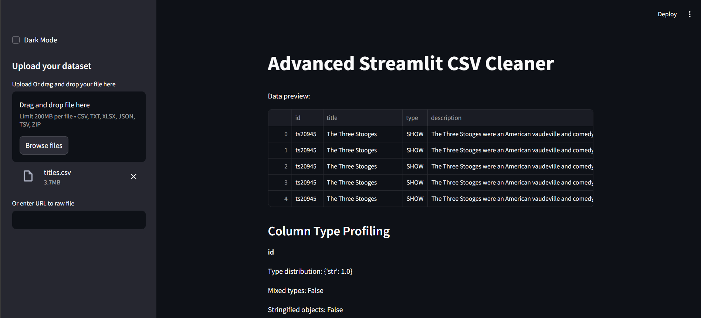
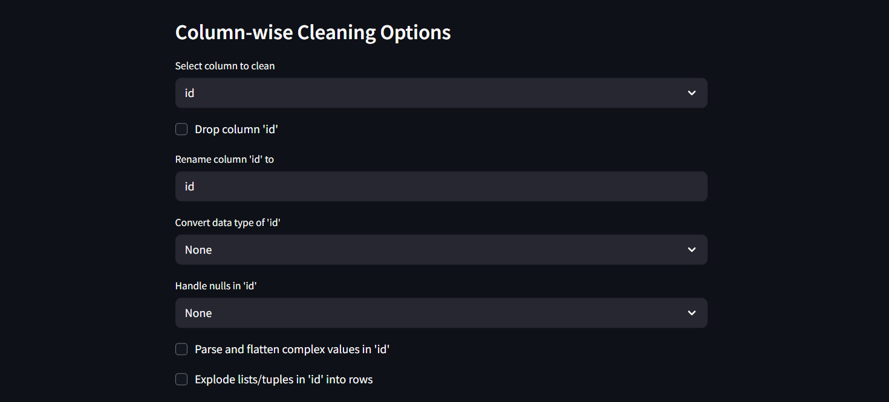
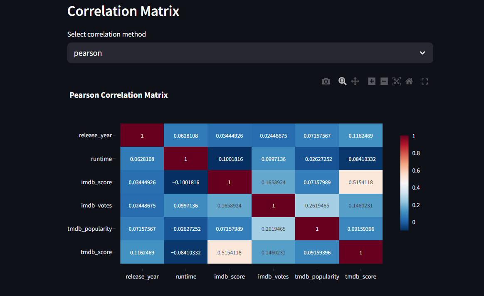
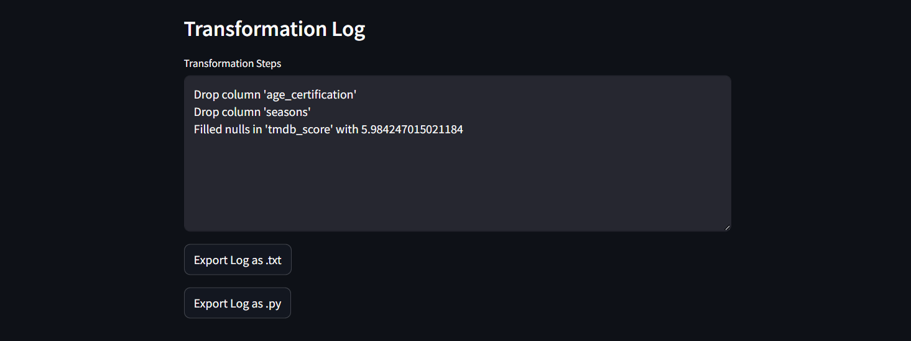

# Advanced Streamlit CSV Cleaner

An advanced CSV cleaner web application built with Streamlit. This app allows users to upload and clean CSV datasets with complex column handling, intelligent data transformation, and visual profiling.

---

## Features

### 1. File Handling
- Upload `.csv`, `.txt`, `.xlsx`, `.json`, `.tsv`, `.zip` (containing CSV) files.
- Load datasets from URLs or raw file links.
- Drag-and-drop file upload support.

### 2. Column Type Detection & Profiling
- Detects column-wise type distribution (int, float, string, list, dict, mixed).
- Flags columns with mixed data types.
- Detects stringified objects (e.g., "['a', 'b']", "{'x':1}").
- Flags empty or null-heavy columns (>50% nulls).

### 3. Advanced Data Parsing
- Parses tuples, lists, dictionaries, JSON, and stringified objects.
- Flattens nested JSON/dictionaries into multiple columns.
- Explodes lists or tuples into multiple rows.

### 4. Column-wise Cleaning Options
- Drop, rename, and reorder columns.
- Convert data types (int, float, str, datetime).
- Handle nulls (drop rows, fill with mean/median/mode/custom).
- Parse and flatten complex values.
- Explode lists or split tuples into new rows.
- Map or replace values.
- Flag and fix inconsistent formats.

### 5. Visual Analytics
- Null value heatmap.
- Correlation matrix (Pearson, Spearman).
- Column distribution charts (pie, bar, histogram, boxplot).
- Outlier detection visualizations.

### 6. Smart Suggestions Panel
- Auto-recommends transformations based on data profiling.

### 7. Transformation Log
- Step-by-step record of all transformations applied.
- Viewable in-app and exportable as `.txt` or `.py` script.

### 8. Export Options
- Download cleaned dataset as `.csv`, `.xlsx`, or `.json`.
- Export transformation logs and Python scripts.
- Generate and download profile reports (`pandas-profiling` or `ydata-profiling`).

### 9. Bonus Features
- Dark mode toggle.
- Responsive UI for mobile and tablet.

---

## Installation

1. Clone the repository:

```bash
git clone <repository-url>
cd <repository-folder>
```

2. Create and activate a virtual environment (optional but recommended):

```bash
python -m venv venv
source venv/bin/activate  # On Windows: venv\Scripts\activate
```

3. Install dependencies:

```bash
pip install -r requirements.txt
```

---

## Usage

Run the Streamlit app:

```bash
streamlit run app.py
```

Open the URL provided by Streamlit (usually `http://localhost:8501`) in your browser.

---

## Screenshots

### Main Interface with Dark Mode Enabled


### File Upload and Data Preview



### Column Type Profiling and Smart Suggestions


### Column-wise Cleaning Options



### Visual Analytics



### Transformation Log and Export Options



---

## Code Structure

- `app.py`: Main Streamlit UI and application logic.
- `parser.py`: Complex type parsers for tuples, lists, dicts, JSON.
- `transformer.py`: Data cleaning and transformation logic.
- `visuals.py`: Visualization functions using Plotly, Seaborn, and Matplotlib.
- `utils.py`: Helper functions for profiling and smart suggestions.
- `logger.py`: Transformation logging utilities.
- `requirements.txt`: Python dependencies.

---

## Contributing

Contributions are welcome! Please open issues or submit pull requests for improvements or bug fixes.

---

## License

This project is licensed under the MIT License.

---

## Acknowledgments

- Built with [Streamlit](https://streamlit.io/)
- Visualization with [Plotly](https://plotly.com/), [Seaborn](https://seaborn.pydata.org/), and [Matplotlib](https://matplotlib.org/)
- Profiling with [pandas-profiling](https://github.com/pandas-profiling/pandas-profiling) and [ydata-profiling](https://github.com/ydataai/ydata-profiling)
